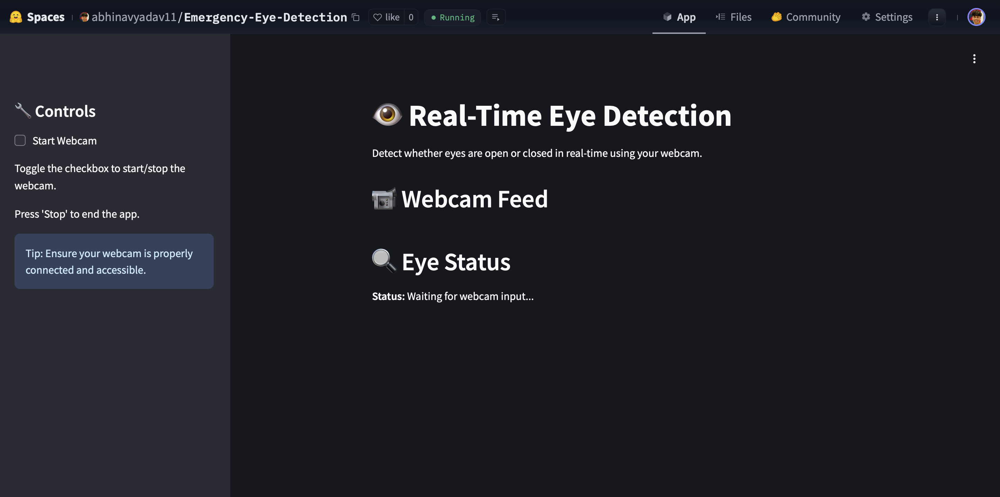

# Emergency-Eye-Detection
Our model detect the eye status at real time

## Try it here : https://huggingface.co/spaces/abhinavyadav11/Emergency-Eye-Detection




# How to Run the Eye Detection Project Locally
## This project requires webcam access for real-time eye detection. Follow the instructions below to set up and run the project locally.

## Prerequisites
 - Python 3.x installed on your machine.
 - A working webcam for eye detection.
 - The following Python libraries are required:
      - OpenCV (opencv-python)
      - TensorFlow or PyTorch (depending on the model you’re using)
      - Any other dependencies listed in requirements.txt.
        
## Steps to Set Up and Run the Project Locally
Clone the Repository
First, clone this repository to your local machine:

```bash
git clone https://github.com/abhinavyadav11/Emergency-Eye-Detection.git
cd Emergency-Eye-Detection
```

### Install Dependencies
Install the necessary Python libraries by running the following command in your terminal:

```bash
pip install -r requirements.txt
```
This will install all the required packages, including OpenCV for webcam access.

Run the Script
To start the eye detection using your webcam, run the script that initiates the webcam access and performs detection. This could be something like eye_detection.py or whatever your main script is called. For example:

```bash
python app.py
```
The script will attempt to access your webcam and display a window with the real-time video feed. If eyes are detected, the model will trigger the necessary actions (like an alert if the eyes are closed for too long).

## Grant Webcam Access
The first time you run the script, your operating system may prompt you to allow access to the webcam. Make sure to grant access to use the webcam for eye detection.

## Close the Webcam Feed
To exit the webcam feed, press q or close the window.

## Troubleshooting
Webcam Not Detected:
Ensure that your webcam is connected and accessible by other applications (e.g., Camera app).
Permission Issues on macOS/Linux:
On some operating systems, you may need to grant additional permissions for webcam access.
Error with OpenCV:
If you encounter errors related to OpenCV or webcam drivers, make sure that your system’s webcam drivers are up to date.
Additional Notes
The model is designed for real-time detection; make sure your webcam can provide a steady video feed for accurate results.
The performance might vary based on your system's processing power and the model used.
